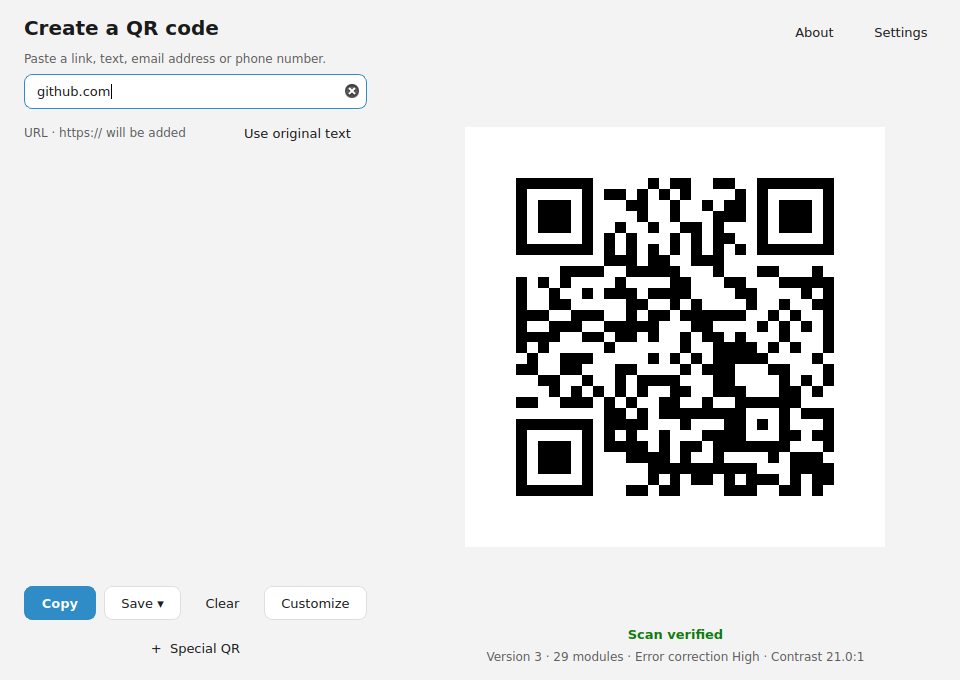

# VYNX QR

**Fast, private QR codes with native Qt Widgets and a Rust engine.**

[](https://github.com/Maks0101aps/VYNX-QR/actions/workflows/ci.yml?query=branch%3A1.1.0-update)

Stable release: Windows v1.0.1. The `1.1.0-update` branch adds Linux x86_64;
release readiness and the pending real Wayland desktop QA are tracked in
[docs/linux-manual-qa.md](docs/linux-manual-qa.md).

Paste a link, text, an email address or a phone number and the code is there
already — classified, rendered, and read back to prove it scans. No account, no
telemetry, no network requests, and no history of what you encoded.




Actual Ubuntu 24.04 / Qt 6.4.2 window under Xvfb/Openbox, captured in
[Actions run 37586370670](https://github.com/Maks0101aps/VYNX-QR/actions/runs/37586370670).
This is automated X11 evidence; manual GNOME/KDE Wayland validation is pending.

## Features

- **One input.** The type is worked out automatically: a URL, an email address, a
  phone number, or plain text. Nothing changes silently — if `https://` is added
  to `github.com` you are told, and you can keep exactly what you typed.
- **Verified, not assumed.** Every code is decoded again by an independent
  decoder after being rendered. "Scan verified" means it was actually read back
  and matched.
- **Structured codes.** Wi-Fi, contact card, email, phone, SMS and location, each
  with a form that updates the code as you type.
- **Customise.** Module shape, both colours, error correction, quiet zone, export
  size, and a logo. A logo raises error correction to High automatically and the
  interface says so rather than reporting what you asked for.
- **Real files.** Save as PNG or as genuine vector SVG. Copy puts an actual image
  on the clipboard, so it pastes into Word or a chat as a picture rather than as a
  file path.
- **Native.** One application process and no browser engine. Measurements for
  Windows and Linux are documented below; AppImage may also use a filesystem mount helper.

## Why VYNX QR

The QR part of this problem was solved years ago; the tooling around it was not.
Most generators are web pages, so they load a browser engine, cost a hundred
megabytes or more of other people's memory, and want a network connection to
work at all. This one is a window: it starts immediately, it works on a plane,
and when you close it the process is gone.

## Privacy

- No network requests. The application links no HTTP client; the one link it can
  open is the repository in About, and it hands that to the system browser.
- The clipboard is read **once**, at start-up, and only if you leave that enabled.
  It is never watched.
- Only preferences are stored: `%APPDATA%\VYNX\QR\settings.json` on Windows,
  `$XDG_CONFIG_HOME/VYNX/QR/settings.json` on Linux, falling back to
  `$HOME/.config/VYNX/QR/settings.json`. Encoded content is never written anywhere.
- No analytics, no crash reporting, no accounts.

## Performance

Measured on Windows 11, idle, release build. Full method in
[docs/performance.md](docs/performance.md).

| | This build | A web-view build |
| --- | --- | --- |
| Processes | **1** | 7 |
| Memory (private) | **33 MB** | 190 MB |
| Idle CPU | 0% | — |

Linux RSS/PSS, startup and idle CPU measurements are in
[docs/performance-linux.md](docs/performance-linux.md). Headless runner results
are labelled as such.

## Installation

Download one of the release artifacts:

- `VYNX-QR-Setup-x64-<version>.exe` — per-user installer, no administrator prompt
- `VYNX-QR-Portable-x64-<version>.zip` — run it from anywhere, nothing installed

After installing, press `Win` and type `VYNX QR`.

Linux candidate packages from Actions (not yet a stable release):

```bash
# Debian 12 / Ubuntu 24.04
sudo apt install ./vynx-qr_1.1.0_amd64.deb
# Arch Linux
sudo pacman -U ./vynx-qr-1.1.0-1-x86_64.pkg.tar.zst
# AppImage, ordinary user
chmod +x VYNX-QR-1.1.0-x86_64.AppImage
./VYNX-QR-1.1.0-x86_64.AppImage
```

Verify `SHA256SUMS.txt` before installing. DEB and Arch use distro Qt; AppImage
bundles Qt and requires a working FUSE environment. Launch `vynx-qr` or the
application-menu entry. Remove with `sudo apt remove vynx-qr`,
`sudo pacman -R vynx-qr`, or delete the AppImage file. Preferences remain in the
XDG directory. Runtime never requires root. Automated artifact checks pass on Debian 12, Ubuntu 24.04 and Arch Linux
(rolling snapshot). AppImage FUSE launch is tested on Ubuntu 24.04. Real
GNOME/KDE Wayland desktop QA is pending; other distro versions are unverified.
No ARM64 or macOS package is provided.

## Keyboard

| Shortcut | Action |
| --- | --- |
| `Ctrl + C` | Copy the code, or the selected text when the input has focus |
| `Ctrl + S` | Save in your preferred format |
| `Ctrl + ,` | Settings |
| `Esc` | Close the open panel, or return to the smart input |

These are in-application shortcuts. VYNX QR never registers a global hotkey.

## Build from source

You need Rust, CMake, the MSVC build tools, Qt 6.5 or newer, and NSIS for the
installer. **Node is not required** — the previous web build is gone.

```powershell
$env:QTDIR = "C:\Qt\6.8.3\msvc2022_64"

cmake --preset release
cmake --build --preset release
cmake --build --preset release --target installer portable
```

Checks:

```powershell
cd core;  cargo fmt --check; cargo clippy --all-targets -- -D warnings; cargo test
cd ..\bridge; cargo fmt --check; cargo clippy --all-targets -- -D warnings; cargo test
cd ..; cmake --preset release; cmake --build --preset release; ctest --preset release
```

Linux uses `cmake --preset linux-release`, `cmake --build --preset linux-release`
and `ctest --preset linux-release`; `linux-debug` includes the Linux window.

Details, including why the Windows debug preset excludes the window, are in
[docs/building.md](docs/building.md).

Icons are generated without any binary asset tooling:

```powershell
node scripts/generate-icons.mjs
```

## Architecture

```
        ┌──────────────────────────┐
        │  Qt 6 Widgets  (app/)    │   the window: input, preview, panels
        └────────────┬─────────────┘
                     │  typed calls, no JSON, no IPC channel
        ┌────────────▼─────────────┐
        │  CXX bridge  (bridge/)   │   the only surface C++ can see
        └────────────┬─────────────┘
                     │
        ┌────────────▼─────────────┐
        │  Rust QR core  (core/)   │   payloads, detection, matrix,
        └──────────────────────────┘   rendering, verification
```

The three layers have one job each, and the boundary is enforced rather than
assumed:

- **Qt** is presentation. It owns widgets, layout, theme and the clipboard, and it
  never encodes anything.
- **The bridge** is typed data transfer. Every payload, option and result is a
  declared struct or enum that both compilers check. A shape mismatch is a build
  error, not a runtime surprise. Panics cannot cross it: every entry point catches
  them and reports a message instead.
- **Rust** is the domain. It owns content detection, URL normalisation, every
  payload encoder, matrix construction, PNG and SVG rendering, logo decoding and
  scan verification. Nothing in it knows that a window exists, which is why it can
  be tested on its own.

The payload is not rebuilt from the encoded string on the C++ side.
`Analysis::encoded` is the finished text of the symbol, so it already carries a
`mailto:`; feeding that back into the email encoder would produce
`mailto:mailto:hello@example.com`. The bridge returns the classification and the
payload together, so that decision is made once, in Rust, where the domain types
live.

## Testing

| | |
| --- | --- |
| Engine | Windows: 128 unit + 14 integration; Linux: 127 unit + 14 integration |
| Bridge | 15 Rust tests for the boundary |
| Native | 50 checks from C++ through the bridge to a scanned result |
| Window | 15 test slots + init/cleanup = 17 QtTest passes; typing, original payload, forms, export, clipboard, theme and logo drops |
| UI | logic states are covered through the native tests rather than by pixels |

## Licence

**VYNX QR Source Available Licence — © 2026 Maks0101aps.**

Free to use for anything, including commercially. Not to be changed without the
author's written permission. See [LICENSE](LICENSE).

This is deliberately *not* an OSI approved licence: withholding the right to
modify is what makes it source-available rather than open source in the strict
sense, and the licence says so rather than pretending otherwise.

Third party components keep their own licences, listed in
[THIRD_PARTY_LICENSES.md](THIRD_PARTY_LICENSES.md). In particular Qt is used
under the LGPL and is dynamically linked; see that file for what that means here.